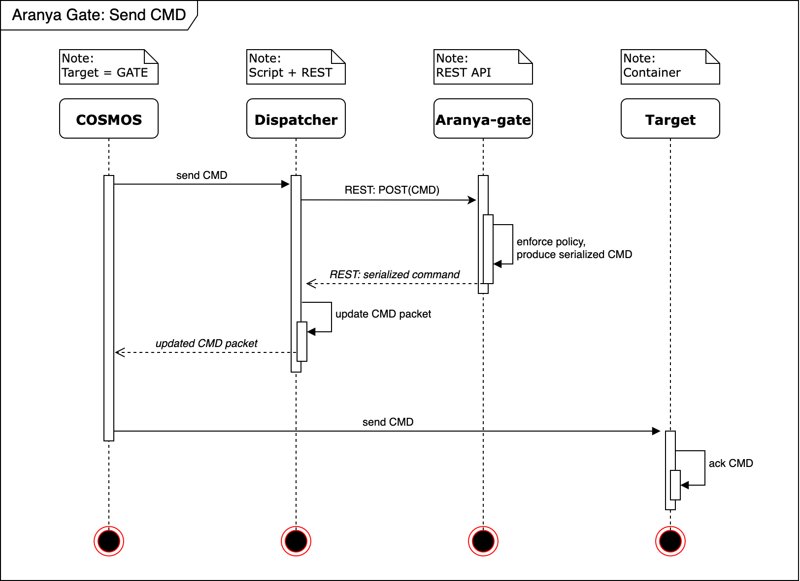

# Aranya-enabled Telecommand Gate for OpenC3 COSMOS

This COSMOS plugin integrates Aranya into a COSMOS commanding workflow. By inserting Aranya into the command path, you can enforce Aranya Policy for fine-grained control over which commands a user can send to a target.

## Prerequisites
1. [Docker Desktop](https://docs.docker.com/get-started/get-docker/) or a Docker engine with Docker Compose
2. [rustup](https://rustup.rs/)

> Note: Tested on Apple Silicon macOS; Linux should behave similarly. Aranya does not support Windows. Running this on Windows would require additional reconfiguration. If you make it work on Windows, please let us know.

## Components
This plugin is one of four pieces used to simulate an operator sending telecommands via COSMOS:

- OpenC3 COSMOS
  - You need access to the COSMOS CLI to build this plugin, or you can install the prebuilt gem `openc3-cosmos-gate-1.0.0.gem` via the COSMOS Admin portal.
  - Update COSMOS’ `docker-compose.yaml` to allow inbound UDP into the `openc3-operator` container. Add to the ports section:
    - `- "127.0.0.1:6201:6201/udp"`
- Aranya cosmos-gate instance
  - Exposes a REST API and processes outgoing telecommands from this plugin’s dispatcher by applying an Aranya Policy.
  - See the [cosmos-gate example README](https://github.com/matcala/aranya/tree/d3c1cd841aba6d64c52d5a0f50637945d045ac87/examples/rust/cosmos-gate) for setup.
- Target application
  - A simple Python “satellite” app in Docker. From the `tools` directory:
    - Build: `docker build -t target .`
    - Run: `docker run --rm --name target -p 6200:6200/udp target:latest`
  - Exposing UDP 6200 lets the container receive COSMOS commands.

## Configuration
Here is an overview of what happens when a user sends a command processed by the Aranya gate:



These parameters must align across components:
- `CMD port`: UDP port where COSMOS’ interface sends command packets (must match the target’s listening port).
- `TLM port`: UDP port where COSMOS listens for telemetry (the target sends telemetry here).
- `rest_endpoint`: Address where the dispatcher posts the command packet to the Aranya gate. Ensure the host and port match the Aranya gate’s listener.
  - The default `host.docker.internal` routes from a container to the host’s machine loopback.

The defaults in this repo should work for the demo without changes.

## Build and Install the Plugin
1. Clone this repository into your `cosmos-project` root.
2. Build the plugin to produce a `.gem` file (or use the provided `openc3-cosmos-gate-1.0.5.gem`).
3. Install the gem via the COSMOS Admin portal.
4. Verify in CmdTlmServer:
   - Interface `GATE_INT` appears and shows CONNECTED.
   - Target `GATE` routes telecommands and telemetry through `GATE_INT`.

This plugin uses a custom WRITE protocol to route telecommands via the dispatcher:
```
  PROTOCOL WRITE <%= _target_name %>/lib/dispatcher.py <%= rest_endpoint %>
```
This tells COSMOS to execute the `dispatcher.py` script every time a telecommand is sent through the `GATE_INT` interface.
The first and only argument `<%= rest_endpoint %>` is passed to the Python script and used to prepare the POST request to the API exposed by the Aranya gate.

> Learn more about custom COSMOS protocols: https://docs.openc3.com/docs/configuration/protocols#custom-protocols

## Running the Demo
1. Start the mock target container:
   - The Python app produces telemetry every second, sent to the configured UDP port as defined in `openc3-cosmos-gate/targets/GATE/cmd_tlm/tlm.txt`.
   - In CmdTlmServer, observe the `rx bytes` and `tlm pkts` counters increasing every second.
   - Use the Packet Viewer tool to inspect inbound telemetry packets.

2. Run the Aranya gate:
   - Follow the [example README](https://github.com/matcala/aranya/tree/d3c1cd841aba6d64c52d5a0f50637945d045ac87/examples/rust/cosmos-gate) for setup.
   - Ensure the REST endpoint matches the dispatcher’s configuration.

3. Test the integration:
   - Open the Command Sender page in COSMOS.
   - Two telecommands are defined for the `GATE` target:
     - Send the `NOOP` command and check CmdTlmServer logs. The dispatcher skips the Aranya gate for this command.
     - Send the `ARANYA_EP_EXP1` command. Logs show the dispatcher sending the packet to the Aranya gate. If the policy allows, the Aranya gate returns a serialized command, which the dispatcher inserts into the `SER_CMD` field. The packet is then sent to the mock target, which logs receipt.

Feel free to modify the dispatcher script to change behavior. The CCSDS function code field determines which packets are checked against the policy.

## Helpers
- [What is Aranya?](https://aranya-project.github.io/)
- [OpenC3 COSMOS - Getting Started](https://docs.openc3.com/docs/getting-started/installation)
- [OpenC3 COSMOS - Plugins](https://docs.openc3.com/docs/configuration/plugins)
- [OpenC3 COSMOS - Custom Protocols](https://docs.openc3.com/docs/configuration/protocols#custom-protocols)
